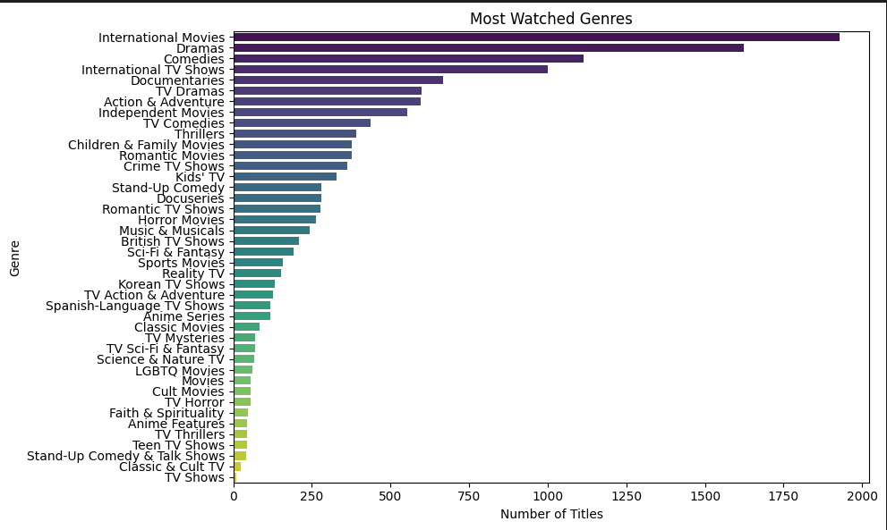
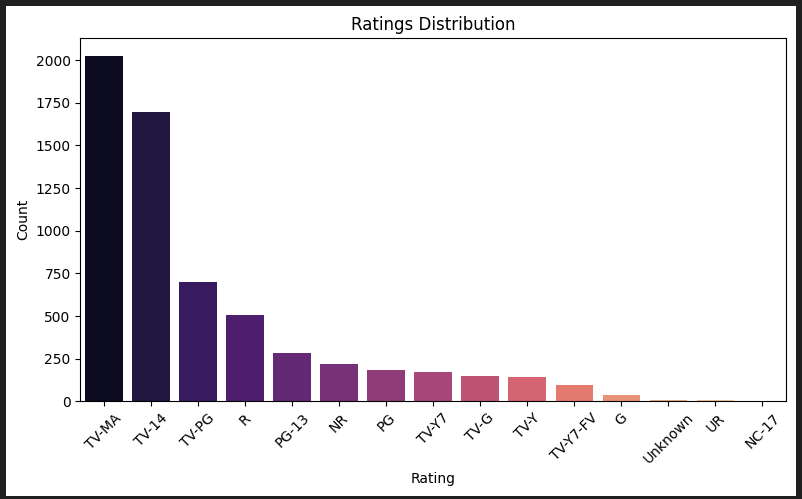

# Netflix Data Analysis Project

## Overview
This project analyzes a Netflix dataset to gain insights through data cleaning, exploration, and visualization. The project uses Python for the majority of the analysis—leveraging a Jupyter Notebook for enhanced readability—and also integrates an R script to generate one of the visualizations.

> **Note:** The `date_added` column is retained in the dataset although it had some missing values because it would not interfere with the visualisations.

## Project Structure
- **Netflix_shows_movies.csv**: The raw Netflix dataset.
- **netflix_analysis.ipynb**: Jupyter Notebook containing the full Python code for data preparation, cleaning, exploration, and visualization.
- **Netflix_R_visualization.R**: R script that generates a bar plot for the ratings distribution using ggplot2.
- **README.md**: This file explaining how to run the project.

## Requirements

### Python Environment
- **Python 3.x**
- **Jupyter Notebook** (or JupyterLab)
- Python Libraries:
  - pandas
  - numpy
  - matplotlib
  - seaborn

### R Environment
- **R** (version 3.x or later)
- **ggplot2** package

## Setup and Running the Project

### Running the Python Analysis (Jupyter Notebook)
1. **Install Python 3 and Jupyter Notebook**  
   If you haven't already, install [Python](https://www.python.org/downloads/) and [Jupyter Notebook](https://jupyter.org/install).

2. **Install Required Python Libraries**  
   Open your terminal or command prompt and run:
   ```bash
   pip install pandas numpy matplotlib seaborn

Most Watched Genres Chart


Ratings Distribution Chart

